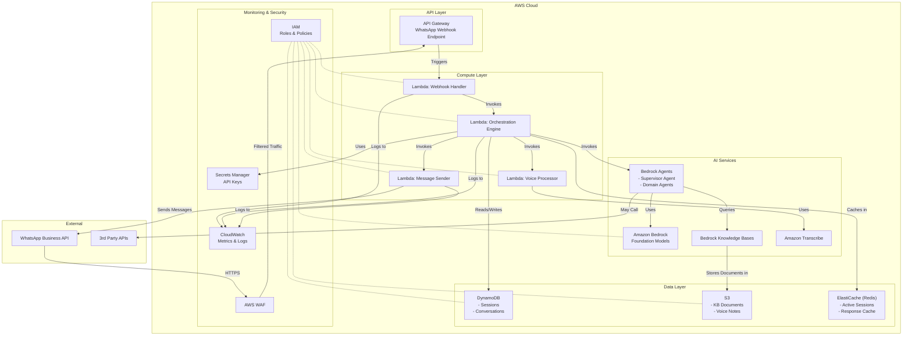

# 16.2 C4 Diagrams

This appendix provides a consolidated view of the C4 (Context, Container, Component, Code) model diagrams for the WhatsApp Multiagent System.

## C1: System Context Diagram

## C2: Container Diagram

## C3: Component Diagram

## C4: Sequence Diagram (Message Processing Flow)

## C4: Deployment Diagram

These diagrams provide multiple views of the WhatsApp Multiagent System at different levels of abstraction, following the C4 model approach:

1. **Context Level (C1)**: Shows the system as a whole and its relationships with users and external systems
2. **Container Level (C2)**: Reveals the high-level technology choices and how responsibilities are distributed
3. **Component Level (C3)**: Shows how containers are composed of components and their interactions
4. **Runtime View**: Illustrates the message processing flow as a sequence diagram
5. **Deployment View**: Shows how the software is mapped to infrastructure

Together, these diagrams provide a comprehensive architectural view of the WhatsApp Multiagent System POC.
