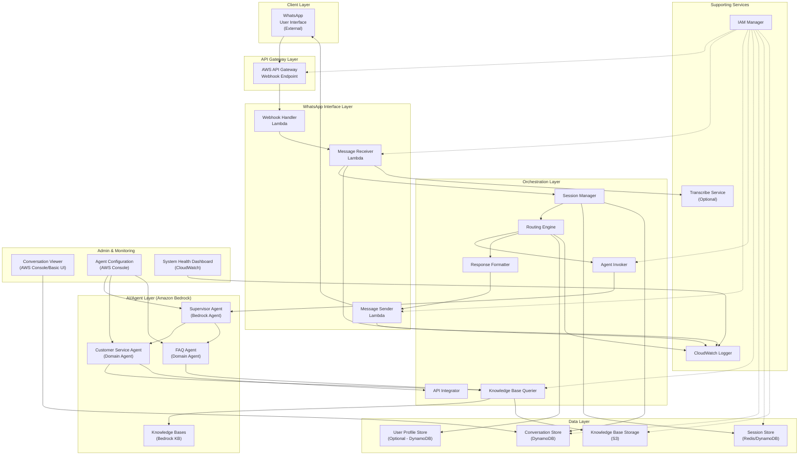

# 7.2 Component Diagram

This section will detail the component diagrams for the WhatsApp Multiagent System, focusing on the Proof of Concept (POC).

## C4 Component Diagram

## Component Descriptions

*   **WhatsApp Interface Layer Components**:
    *   Message Receiver: Handles incoming messages from the WhatsApp Business API, processes message types, and forwards them to the orchestration layer.
    *   Message Sender: Formats and sends outgoing messages via the WhatsApp Business API, handling different message types and media.
    *   Webhook Handler: Manages webhook events from the WhatsApp API (e.g., message status updates, delivery confirmations).

*   **Orchestration Layer Components (AWS Lambda/Step Functions)**:
    *   Session Manager: Maintains user conversation context, handles session creation/retrieval/update operations, and applies TTL policies.
    *   Routing Engine: Analyzes intent and routes user requests to appropriate Bedrock Agents, tracks conversation flow, and handles fallbacks.
    *   Agent Invoker: Creates properly formatted requests for Amazon Bedrock, handles response processing, and implements error handling and retries.
    *   Knowledge Base Querier: Constructs queries for Amazon Bedrock Knowledge Bases, filters and ranks results, and handles result transformation.
    *   API Integrator: Establishes connections to 3rd party APIs, handles authentication, transforms data formats, and implements caching strategies.
    *   Response Formatter: Formats agent responses for WhatsApp, ensures message compatibility, and splits long responses if necessary.

*   **AI/Agent Layer Components (Amazon Bedrock)**:
    *   Supervisor Agent (Bedrock Agent): Analyzes intent, determines appropriate domain agent, handles clarification when needed, and maintains conversation coherence.
    *   Customer Service Agent (Domain Agent): Handles general customer inquiries, accesses knowledge bases, and follows defined workflows.
    *   FAQ Agent (Domain Agent + Knowledge Base): Answers frequently asked questions using specialized knowledge bases.
    *   Knowledge Bases: Structured collections of documents and data that agents can query for information retrieval.

*   **Data Layer Components**:
    *   Conversation Store (DynamoDB): Records complete conversation history, implements TTL for data retention, and supports analytics.
    *   Session Store (ElastiCache/DynamoDB): Maintains active session data with fast access times and implements appropriate TTL strategies.
    *   Knowledge Base Storage (S3): Stores and organizes documents for Bedrock Knowledge Bases with versioning support.
    *   User Profile Store (Optional): Maintains basic user information and preferences if needed for personalization.

*   **Supporting Services Components**:
    *   API Gateway: Exposes Lambda functions as HTTP endpoints with authentication, rate limiting, and usage plans.
    *   IAM Manager: Implements least-privilege permissions for all services and manages service role configurations.
    *   CloudWatch Logger: Provides centralized logging with appropriate log levels, structured logging, and log retention policies.
    *   Transcribe Service (Optional): Processes voice notes to convert speech to text for agent processing.

*   **Administrative & Monitoring Interface Components**:
    *   Conversation Viewer: Allows administrators to search, view, and analyze conversations for quality and improvement opportunities.
    *   Agent Configuration Interface: Provides basic tools for prompt engineering and knowledge base connections.
    *   System Health Dashboard: Visualizes key metrics and provides alerts on system performance issues.

This component breakdown is for the POC and will evolve as the system matures. The primary focus for the POC is the core message processing, orchestration, and Bedrock agent interaction via WhatsApp.
