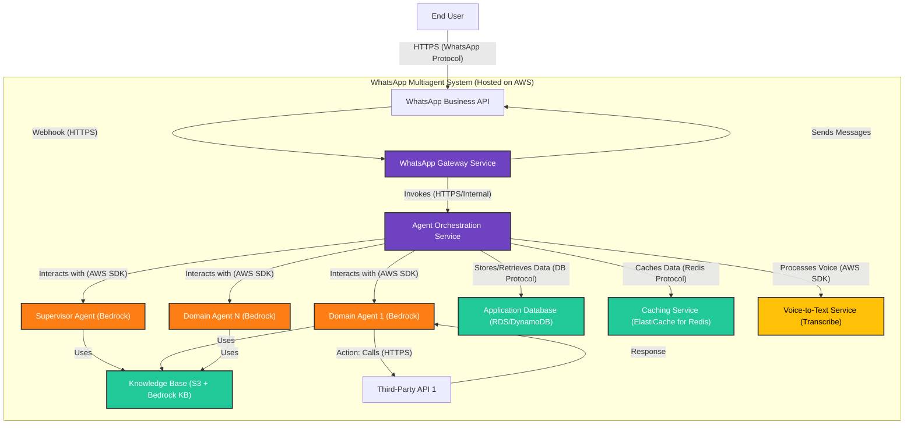

# 7.2 Container Diagram (Level 2)

This diagram zooms into the **WhatsApp Multiagent System** boundary defined in the System Context diagram. It shows the major logical containers (applications, data stores, and managed services) that make up the system and their interactions.

**WhatsApp Gateway Service** (Node.js Application on Lambda/ECS):
- Receives/Sends WhatsApp messages
- Initial Validation
- Secure Credential Management

**Agent Orchestration Service** (Node.js Application on Lambda/ECS):
- Core backend logic
- Conversation & Session Management
- Invokes Bedrock Agents
- Knowledge Base & API interaction management

**Bedrock Agents** (Managed AWS Service):
- Supervisor & Domain specific logic
- NLU, NLG, Tool Use

## Containers:

1.  **WhatsApp Gateway Service (Node.js Application):**
    *   **Technology:** Node.js, likely running on AWS Lambda with API Gateway, or a lightweight container on AWS ECS/Fargate.
    *   **Responsibilities:**
        *   Receives incoming webhook events (messages, status updates) from the WhatsApp Business API.
        *   Validates incoming requests.
        *   Formats and sends outgoing messages to the WhatsApp Business API.
        *   Securely handles WhatsApp Business API credentials.
        *   Forwards processed incoming messages to the Agent Orchestration Service.
2.  **Agent Orchestration Service (Node.js Application):**
    *   **Technology:** Node.js, likely running on AWS Lambda or AWS ECS/Fargate.
    *   **Responsibilities:**
        *   The central nervous system of the application.
        *   Manages the lifecycle of conversations (session state, history).
        *   Invokes the Supervisor Agent (Amazon Bedrock) with user input and context.
        *   Based on Supervisor Agent's output, invokes appropriate Domain Agents (Amazon Bedrock) or other tools.
        *   Coordinates interactions with Knowledge Bases (via Bedrock Agents).
        *   Orchestrates calls to Third-Party APIs (either directly or via Bedrock Agent actions).
        *   Interfaces with the Voice-to-Text service.
        *   Reads from and writes to the Application Database and Caching Service.
3.  **Supervisor Agent (Amazon Bedrock Agent):**
    *   **Technology:** Amazon Bedrock (Managed Service).
    *   **Responsibilities:**
        *   Understands initial user intent from natural language.
        *   Asks clarifying questions if needed.
        *   Determines the appropriate Domain Agent or tool to handle the request.
        *   Routes the conversation accordingly.
4.  **Domain Agents (Amazon Bedrock Agents):**
    *   **Technology:** Amazon Bedrock (Managed Service).
    *   **Responsibilities:**
        *   Handle specific business domains or tasks (e.g., customer support, sales).
        *   Utilize associated Knowledge Bases for information retrieval (RAG).
        *   Invoke configured actions/tools, which may include calling Third-Party APIs.
5.  **Application Database:**
    *   **Technology:** Amazon RDS (e.g., PostgreSQL) or Amazon DynamoDB.
    *   **Responsibilities:**
        *   Stores business registration details.
        *   Stores agent configurations (supervisor, domain agents, knowledge base links, API credentials for tools).
        *   Persists conversation history and user session data.
6.  **Caching Service:**
    *   **Technology:** Amazon ElastiCache for Redis.
    *   **Responsibilities (Phase 2 onwards for POC):**
        *   Caches frequently accessed data (e.g., agent configurations).
        *   Caches responses from Bedrock or Third-Party APIs to improve performance.
        *   Stores temporary session state if needed.
7.  **Knowledge Base Store:**
    *   **Technology:** Amazon S3 (for storing documents) integrated with Amazon Bedrock Knowledge Bases.
    *   **Responsibilities:**
        *   Provides the information corpus for Bedrock Agents to perform Retrieval Augmented Generation (RAG).
8.  **Voice-to-Text Service:**
    *   **Technology:** Amazon Transcribe (or a native Bedrock capability if suitable).
    *   **Responsibilities:**
        *   Converts audio from user voice notes into text for processing by the agents.

## Interactions:

*   The **End User** interacts via the **WhatsApp Business API**.
*   The **WhatsApp Gateway Service** is the entry/exit point for WhatsApp messages, communicating with the **Agent Orchestration Service**.
*   The **Agent Orchestration Service** invokes **Bedrock Agents** (Supervisor and Domain), uses the **Voice-to-Text Service**, and persists/retrieves data from the **Application Database** and **Caching Service**.
*   **Bedrock Agents** utilize the **Knowledge Base Store** and can trigger actions that may involve **Third-Party APIs**.

This container view clarifies the main deployable and manageable parts of the system and how they collaborate.
