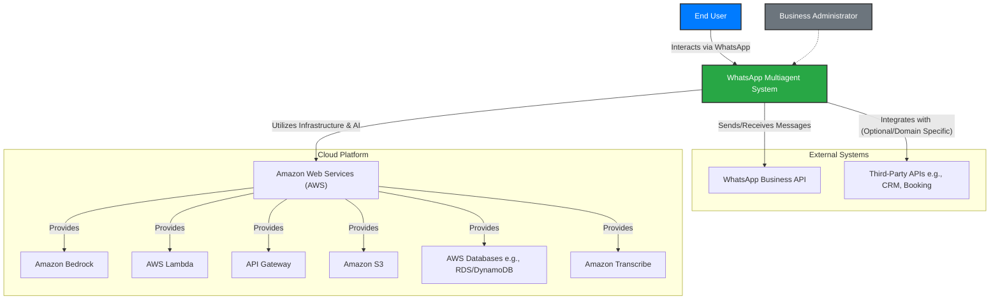

# 7.1 System Context Diagram (Level 1)

This diagram illustrates the highest level of abstraction for the **WhatsApp Multiagent System**, showing it as a single entity and its interactions with users, other systems, and external services.

## Key Interactions:

*   **End User & WhatsApp Multiagent System:**
    *   The End User sends messages (text, voice notes) and receives responses through their WhatsApp application.
    *   The System processes these messages using its AI capabilities.
*   **WhatsApp Multiagent System & WhatsApp Business API:**
    *   The System uses the WhatsApp Business API to connect to the WhatsApp platform, enabling two-way message flow.
*   **WhatsApp Multiagent System & Amazon Web Services (AWS):**
    *   AWS provides the foundational cloud infrastructure, including:
        *   **Amazon Bedrock:** For the Supervisor and Domain Agents (NLU, NLG, tool use, knowledge base access).
        *   **AWS Lambda/EC2/ECS:** For hosting the backend application logic (WhatsApp Gateway, Agent Orchestration).
        *   **Amazon API Gateway:** To expose HTTP endpoints for WhatsApp webhooks.
        *   **Amazon S3:** For storing knowledge base documents, potentially voice notes, and logs.
        *   **AWS Databases (RDS/DynamoDB):** For storing configurations, conversation history, and business data.
        *   **Amazon Transcribe:** For converting voice notes to text.
*   **WhatsApp Multiagent System & Third-Party APIs:**
    *   Domain Agents within the System may connect to various external APIs to fetch information or perform actions (e.g., checking order status from a CRM, booking an appointment). This is highly dependent on the specific domain agent's function.
*   **Business Administrator & WhatsApp Multiagent System (Future):**
    *   In future phases, Business Administrators will have a dedicated interface (likely web-based) to configure their company accounts, manage domain agents, update knowledge bases, and view analytics. For the POC, this interaction is out of scope.

This context diagram sets the stage for understanding the system's boundaries and its primary external dependencies.
