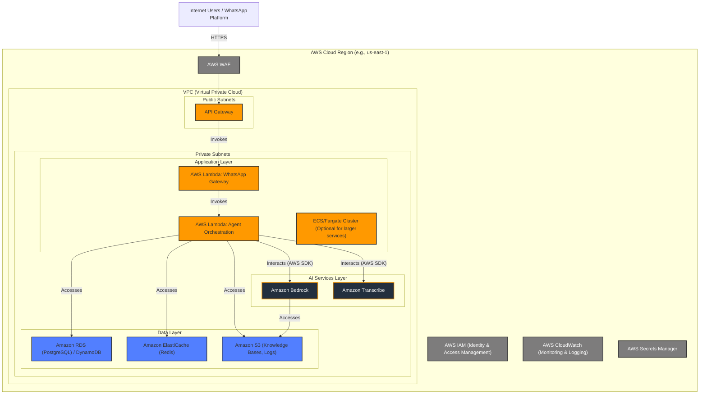

# 9 Deployment View

This section describes how the containers of the WhatsApp Multiagent System are deployed onto the physical (or virtualized) infrastructure, primarily within Amazon Web Services (AWS).

## Deployment Environment: AWS Cloud

The entire system is designed to be deployed on AWS, leveraging its managed services for scalability, reliability, and operational efficiency.

## Deployment Units & Infrastructure:

1.  **API Gateway (Amazon API Gateway):**
    *   Deployed in public subnets.
    *   Serves as the HTTPS endpoint for WhatsApp Business API webhooks.
    *   Integrates with AWS WAF for basic security.
    *   Routes requests to the WhatsApp Gateway Service (AWS Lambda).

2.  **WhatsApp Gateway Service (AWS Lambda):**
    *   Deployed as a Node.js Lambda function in private subnets.
    *   Triggered by API Gateway.
    *   Processes incoming WhatsApp messages and forwards them to the Agent Orchestration Service.
    *   Sends outgoing messages back through the WhatsApp Business API (not directly shown in this infra diagram's request flow but implied).

3.  **Agent Orchestration Service (AWS Lambda):**
    *   Deployed as a Node.js Lambda function in private subnets.
    *   Receives requests from the WhatsApp Gateway Service.
    *   Orchestrates interactions with Amazon Bedrock (Supervisor and Domain Agents), Amazon Transcribe, Application Database, Caching Service, and Knowledge Bases on S3.
    *   *Alternative:* For more complex or longer-running orchestration tasks, this could be deployed on AWS ECS/Fargate within private subnets. POC will prioritize Lambda.

4.  **Amazon Bedrock (Managed Service):**
    *   Region-specific AWS service.
    *   Hosts the Supervisor and Domain Agents.
    *   Accessed by the Agent Orchestration Service via AWS SDK.
    *   Accesses Knowledge Bases stored in Amazon S3.

5.  **Amazon Transcribe (Managed Service):**
    *   Region-specific AWS service.
    *   Used for voice-to-text conversion.
    *   Accessed by the Agent Orchestration Service via AWS SDK.

6.  **Application Database (Amazon RDS PostgreSQL / Amazon DynamoDB):**
    *   Deployed in private subnets.
    *   RDS instances would typically have primary and standby replicas across different Availability Zones for high availability (Post-POC).
    *   DynamoDB is inherently highly available.
    *   Accessed by the Agent Orchestration Service.

7.  **Caching Service (Amazon ElastiCache for Redis):**
    *   Deployed in private subnets, typically with nodes across different Availability Zones (Post-POC).
    *   Accessed by the Agent Orchestration Service.

8.  **Knowledge Base Store (Amazon S3):**
    *   Regional or global service.
    *   Stores documents for Bedrock Knowledge Bases.
    *   Accessed by Amazon Bedrock and potentially by the Agent Orchestration Service for management tasks.

## Supporting AWS Services:

*   **AWS WAF (Web Application Firewall):**
    *   Protects the API Gateway endpoint from common web exploits (Phase 3).
*   **AWS IAM (Identity & Access Management):**
    *   Manages permissions for all AWS resources, ensuring least privilege access.
*   **AWS CloudWatch:**
    *   Used for logging (Lambda logs, API Gateway logs, application logs) and monitoring (metrics for Lambda, API Gateway, Bedrock usage, database performance, etc.). Alarms can be configured for operational issues.
*   **AWS Secrets Manager:**
    *   Securely stores and manages sensitive information like API keys for WhatsApp and third-party services, and database credentials.
*   **VPC (Virtual Private Cloud):**
    *   Provides network isolation for the deployed resources. Public subnets for internet-facing resources (API Gateway) and private subnets for backend services and databases.

## CI/CD (GitHub Actions - Phase 4 for POC):

*   GitHub Actions will be used to build and package the Node.js Lambda functions (WhatsApp Gateway, Agent Orchestration Service).
*   The pipeline will deploy these functions and any API Gateway configurations to the AWS environment (initially a test/dev environment).
*   Infrastructure as Code (e.g., AWS SAM, CloudFormation, or CDK) will be considered for managing AWS resources declaratively (Post-POC for full maturity, basic for POC if time allows).

This deployment view illustrates a serverless-first approach for the POC, leveraging managed services to reduce operational overhead and facilitate scalability.
