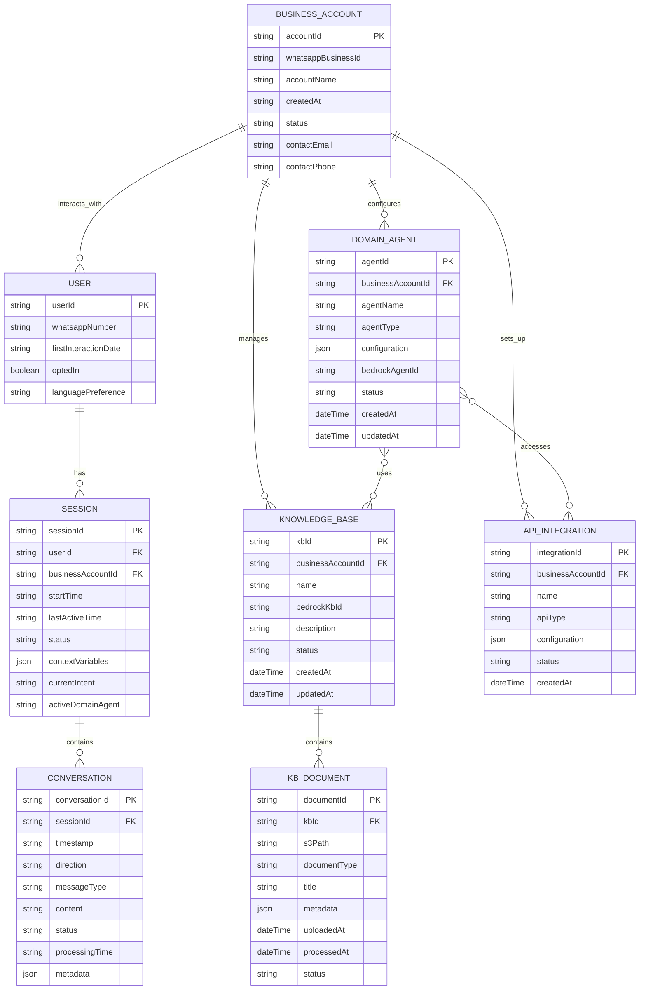

# 16.3 Entity Relationship Diagram

This section provides the entity relationship model for the WhatsApp Multiagent System POC, focusing on the core data structures needed to manage conversations, sessions, and knowledge bases.

## Key Entities

- **BUSINESS_ACCOUNT**: Represents a company that has registered with the WhatsApp Multiagent System, connecting their WhatsApp Business Account.

- **USER**: Represents end-users who interact with the business via WhatsApp, identified by their WhatsApp number.

- **SESSION**: Represents an ongoing conversation context between a user and the system, maintaining state across multiple messages.

- **CONVERSATION**: Stores individual messages exchanged between users and agents, with metadata about processing.

- **DOMAIN_AGENT**: Represents configured AI agents specialized in specific business domains or functions.

- **KNOWLEDGE_BASE**: Represents collections of documents and information that agents can query to respond to user inquiries.

- **KB_DOCUMENT**: Individual documents stored in knowledge bases, with metadata to facilitate retrieval.

- **API_INTEGRATION**: Configurations for third-party APIs that domain agents can access to retrieve information or perform actions.

## Database Implementation Notes

For the POC phase:
- **DynamoDB Tables**: SESSION, CONVERSATION (with appropriate TTL settings)
- **S3 Storage**: For KB_DOCUMENT content
- **Amazon Bedrock**: Will natively manage parts of DOMAIN_AGENT and KNOWLEDGE_BASE entities
- **Simple Configuration Files**: For initial BUSINESS_ACCOUNT, API_INTEGRATION (more sophisticated database implementation post-POC)

This ERD represents the conceptual data model. The actual implementation for the POC may use a simplified version, with plans to evolve toward this complete model in future phases.
