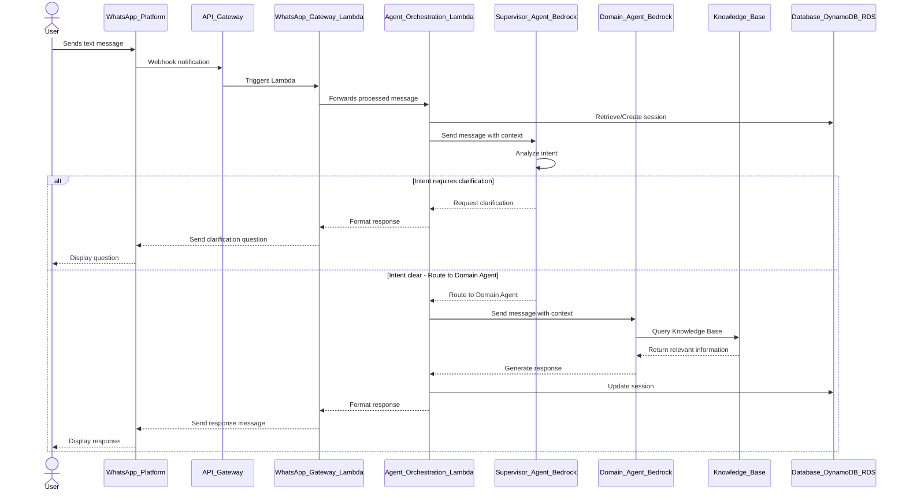

# 8 Runtime View

The runtime view illustrates key scenarios and interactions between components during system operation. For the WhatsApp Multiagent System, we'll focus on the primary interaction flows between users, the WhatsApp API, and our backend services.

## Key Scenarios

1. **Basic Text Message Processing**: User sends a text message and receives a response.
2. **Voice Note Processing**: User sends a voice note, which is converted to text and processed.
3. **Session Management**: How user context is maintained across a conversation.
4. **Domain Agent Selection**: How the supervisor agent routes queries to specialized domain agents.
5. **Knowledge Base Query**: How agents retrieve information from knowledge bases.

Below is a high-level sequence diagram for text message processing. Specific scenarios are detailed in separate documents.

The diagram above represents a simplified view of the message processing flow. In practice, there would be additional error handling, retries, and potentially more complex interactions between components.
